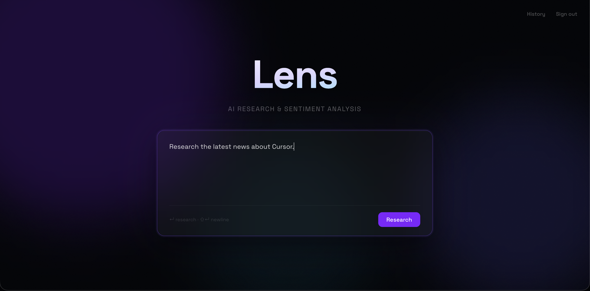
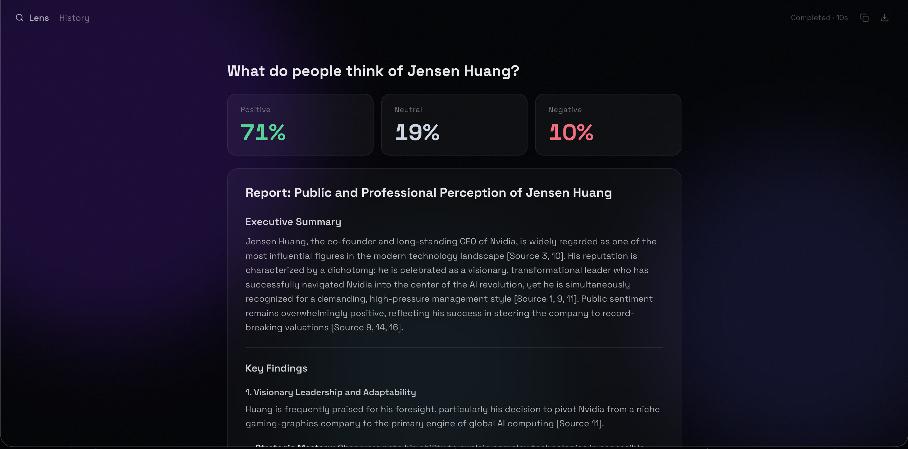
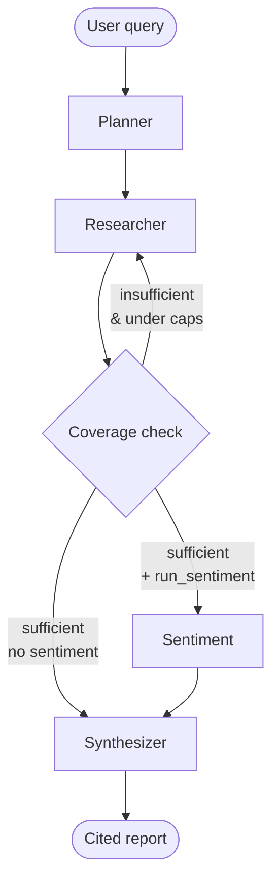
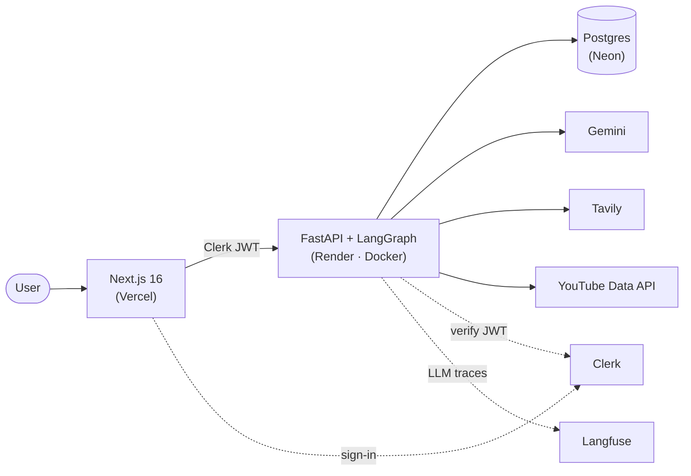

# Lens

**Ask a research question in plain English; get back an AI report that blends live web research with public sentiment from YouTube comments.**

[](https://github.com/RoyalAscot1/research-agent/actions/workflows/ci.yml)

Full-stack, agentic AI app. You type a natural-language query; a LangGraph agent plans how to research it, gathers web sources via Tavily, optionally scores YouTube-comment sentiment, and synthesizes a cited report. You can ask up to five follow-ups per report, and every query is saved to a per-user history.





## What it does

- **Natural-language research** — type a question; the agent decides how to research it. No source config or knobs.
- **Cited web reports** — [Tavily](https://tavily.com) web results synthesized into a cited report with linked source cards.
- **YouTube-comment sentiment** — when relevant, scores top comments with VADER (Positive / Neutral / Negative).
- **Follow-up Q&A** — up to five follow-ups per report, answered from frozen research context in ~3 seconds.
- **Per-user history** — saved queries with sentiment badge and run time; reopen, delete, or clear all.
- **Auth** — Google sign-in via [Clerk](https://clerk.com); reports scoped to the signed-in user.

## The agent

The core of Lens is a [LangGraph](https://langchain-ai.github.io/langgraph/) agent that decides how to research a query: it plans, researches, judges whether it has enough, and loops back before writing.



The LLM drives the decisions via structured output: the **planner** decomposes the query into 1–3 sub-queries and decides whether sentiment is relevant; the **researcher** runs them through Tavily, de-duplicating by URL across rounds; the **coverage check** judges whether the sources are sufficient or loops back with new sub-queries.

**Hard caps bound cost:** the loop is capped at 3 iterations and 5 Tavily calls. Worst case is 9 node executions — at most 5 Gemini and 5 Tavily calls; typical queries resolve in 1–2 rounds. Follow-ups don't re-run the agent — they answer from the report's frozen `raw_context`.

## Architecture

Two independently deployed services share one Postgres database:



- **Frontend** — Next.js 16 on **Vercel**, auto-deploys on push to `main`.
- **Backend** — FastAPI + LangGraph in a **Docker** container on **Render** (`/health` check).
- **Database** — managed **Postgres** on **Neon**, shared by both services.
- **Auth** — **Clerk** issues the JWT; the backend verifies it against Clerk's JWKS (RS256), pinning issuer and authorized party.
- **Observability** — **Langfuse** traces LLM calls; structured JSON logs cover the rest (see [Observability](#observability)).

The agent runs as a FastAPI `BackgroundTask`, persisting status and the report to Postgres while the frontend polls. **Alembic owns all migrations.**

## Tech stack

| Layer | Tools |
|-------|-------|
| Frontend | Next.js 16, TypeScript, Tailwind v4, shadcn/ui, framer-motion |
| Backend | FastAPI, LangGraph, SQLAlchemy (async), Alembic |
| AI | Gemini, Tavily, YouTube Data API, VADER |
| Data | Postgres (Neon), Clerk (auth) |
| Infra | Docker, Render, Vercel, GitHub Actions |
| Observability | Langfuse, structlog, Sentry, slowapi |

See [`app_summary.md`](app_summary.md) for the full stack breakdown and rationale.

## Running locally

Needs Python 3.12, Node 20+, and a Postgres database. API keys: Gemini, Tavily, YouTube, Clerk, Langfuse.

**Backend**
```bash
cd backend
python -m venv .venv && source .venv/bin/activate
pip install -r requirements.txt
cp .env.example .env        # fill in keys + DATABASE_URL
alembic upgrade head
uvicorn app.main:app --reload
```

**Frontend**
```bash
cd frontend
nvm use 20
npm install
cp .env.local.example .env.local   # fill in API URL + Clerk keys
npm run dev
```

**Tests** — 71 pytest tests covering the graph nodes, auth, and API endpoints, with external services and the DB faked. Run `python -m pytest` from `backend/`.

**CI/CD** — GitHub Actions runs Ruff + pytest on every push; branch protection gates merges to `main` on those checks. Vercel auto-deploys the frontend on merge; the Render backend ships via Docker on demand.

## Observability

Three layers: **Langfuse** traces every LLM call (prompts, outputs, per-node latency); **structured JSON logs** (`structlog`) cover the operational surface — DB, auth, request lifecycle, and Tavily/YouTube failures — with a correlation id per job and per request; **Sentry** is wired for error alerting (active when `SENTRY_DSN` is set). Per-user rate limiting via `slowapi` caps the paid API paths.

## Production considerations

Built as a portfolio piece, with the production trade-offs documented rather than hidden. See [`PRODUCTION_READINESS.md`](PRODUCTION_READINESS.md) for the full phased plan and the deliberate scope calls. Intentionally deferred to v2: a durable task queue (ARQ) in place of in-process `BackgroundTasks`, pgvector semantic retrieval for follow-ups, Redis caching, and per-step progress reporting.
